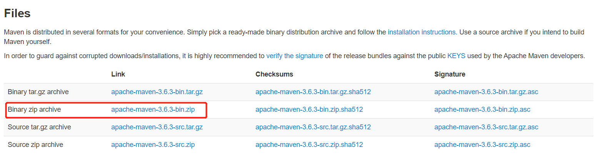
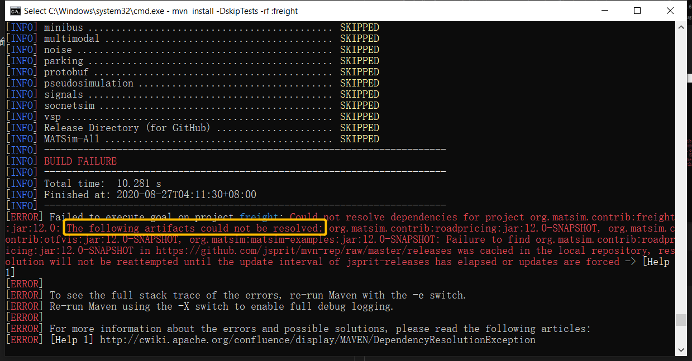

# MATSim安装教程

## 1 获取MATSim项目源文件
url = "https://github.com/matsim-org/matsim-libs/releases/tag/matsim-12.0"


二选一即可, 解压到路径 = 自选(无中文字符和空格即可, 例如: D:\Java\matsim-libs-matsim-12.0)。如下所示


## 2 安装Java开发环境
### 2.1 从Oracle官网下载JDK11

url = "https://www.oracle.com/java/technologies/javase-jdk11-downloads.html"

注册后可以下载, 自选Windows和Linux版本

Windows版本选择(推荐64位, 32位运行内存太小对使用MATSim严重不利)


### 2.2 安装JDK
安装路径 = 自选(无中文字符和空格即可, 例如: D:\Java\jdk-11.0.8)

添加系统环境变量
```sh
JAVA_HOME
```
JAVA_HOME值设置为安装路径

在系统环境变量设置中，给变量Path添加
```sh
%JAVA_HOME%/bin
```
使用命令
```sh
java -version
```
得到<br>


## 3 安装Apache Maven
url = "http://maven.apache.org/download.cgi"
选择


解压到路径 = 自选(无中文字符和空格即可, 例如: D:\Java\apache-maven-3.6.3)。如下图所示


在系统环境变量设置中，给变量Path添加
```sh
解压路径\bin
```
例如: D:\Java\apache-maven-3.6.3\bin

使用命令
```sh
mvn --version
```
得到<br>


配置Apache Maven的全局设置

全局设置文件在Apache Maven解压路径下的\conf\settings.xml, 例如: D:\Java\apache-maven-3.6.3\conf\settings.xml。

更改其中元素`<localRepository>`为
`<localRepository>${java.home}/repository</localRepository>`
如下图所示


## 4 安装MATSim到本地的repository

切换到MATSim项目源文件的解压位置，例如：D:\Java\matsim-libs-matsim-12.0
```sh
d:
cd D:\Java\matsim-libs-matsim-12.0
```
编译、打包并安装MATSim到本地的repository（运行时间较长耐心等待，本文经历了1h）
```sh
mvn install -DskipTests
```
如下图所示


Error处理
* Connection reset

解决方法：调整网络（等待或者更换）后，因为connection_reset发生在freight模块，故从freight模块重新开始，避免重复安装(上图已经用时1:33h)。执行以下命令
```sh
mvn install -DskipTests -rf :freight
```


* artifacts could not be resolved

解决方法：经过代码查阅，发现freight模块的pom中matsim.version为12.0-SNAPSHOT，然而上述matsim的版本为12.0。因此，需要修正freight的pom。其pom位于`matsim项目源文件\contribs\freight\pom.xml`，例如`D:\Java\matsim-libs-matsim-12.0\contribs\freight\pom.xml`。<br>
设置matsim.version为12.0, 如下图所示
<br>
此外，integration、vsp模块也存在同样问题，解决方法同上。

安装约2小时后，成功结果如下图所示


## 5 MATSim运行测试

将附件[pt_and_dvrp.rar](./pt_and_dvrp.rar)解压到路径 = 自选(无中文字符和空格即可, 例如: D:\Java\\)

切换到该解压位置，例如：D:\Java\pt_and_dvrp
```sh
d:
cd D:\Java\pt_and_dvrp
```
编译pt_and_dvrp
```sh
mvn clean compile
```
结果如下图所示


运行pt和taxi的混合仿真
```sh
mvn exec:java -Dexec.mainClass="org.matsim.pt_and_dvrp.Intermodal"
```
结果如下图所示

并且在解压位置处将仿真结果输出到`output/intermodalExample`文件夹

获取MATSim的完整配置文件
```sh
mvn exec:java -Dexec.mainClass="org.matsim.pt_and_dvrp.GetFullConfig"
```
结果如下图所示

并且在解压位置处将`full_config.xml`保存到`output/`文件夹